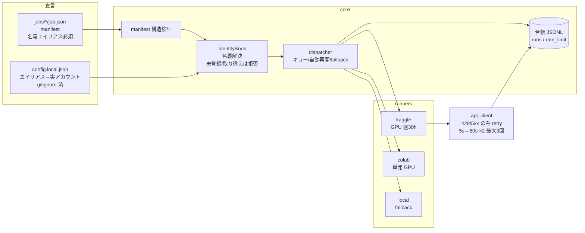

# cloud-autopilot

社会シミュレーターを、クラウド (Kaggle / Colab、拡張先として Google Cloud) で効率よく回すための
runner 基盤。軸は「クラウドで回す」こと。無料枠は使える環境で優先するが、縛りではない。

**シミュレーターの中身は作らない。** 作るのは「手元のシミュレーターを、クラウドの実行環境へ
運んで実行し、結果と証跡を持ち帰る」部分だけ。誰でも自分のアカウントで clone して動かせる。

## 目的

シミュレーション実験は GPU が要るが、常時使える GPU を持たない人は多い。この repo は
「手元のシミュレーターをクラウドへ運んで実行し、証跡付きで結果を持ち帰る」部分
**だけ**を引き受け、誰でも自分のアカウントで再現できる形に保つ。

## できること

- ジョブ定義 (manifest) のスキーマと検証 — どのシミュレーターを・どの実行環境で・どの名義で回すか
- 実行環境ごとの adapter (Kaggle / Colab / ローカル)
- 実行の記録 (いつ・どこで・どの名義で・成功したか) を残す台帳
- レート制限とクォータ切れへの対処 (バックオフ・自動再開・local への fallback)
- 中断からの自動再開 (完了済みジョブはスキップ)

**入れないもの (境界)**

- アカウント名・メールアドレス・認証情報 — すべて `config.local.json` (gitignore 済) から読む
- 実行結果・台帳・ジョブ出力 — gitignore。生成物は repo に置かない
- 環境固有の識別子 (クラウドのプロジェクト名など)
- シミュレーター本体の実装 (別 repo の責務)
- 汎用 AI ジョブ実行基盤としての拡張 (用途をシミュレーターに絞る)

## クイックスタート

AI エージェントに任せる場合は、この URL を貼って「セットアップして」と依頼する:
`https://github.com/nexus-ai-2045/cloud-autopilot`

手動の場合 (前提: Python 3.10 以上。標準ライブラリのみで動く。テスト実行だけ pytest が必要):

```bash
git clone <this-repo> && cd cloud-autopilot

# 1. 名義を登録する (config.local.json は commit されない)
cp config.example.json config.local.json
#    → エディタで開き、自分のアカウント名を記入

# 2. まずローカルで動作確認 (クラウド不要)
python autopilot.py queue

# 3. Kaggle で実走 (要: kaggle CLI + ~/.kaggle/kaggle.json。runners/kaggle/README.md 参照)
python autopilot.py run jobs/sim-smoke/job.json

# 状態確認 / テスト
python autopilot.py status
python -m pytest tests/ -q
```

設定が無い・不備がある場合は**黙って動かず、何が足りないかを言って停止する** (fail-closed)。

## 全体像



## ジョブの書き方

`jobs/<job名>/job.json` に manifest を 1 つ置く:

```json
{
  "name": "cloud-autopilot-sim-smoke",
  "runner": "kaggle",
  "identity": "kaggle-main",
  "entrypoint": "kernel",
  "gpu": true,
  "fallback": ["local"]
}
```

| フィールド | 意味 |
|---|---|
| `name` | ジョブ名。Kaggle では kernel slug にもなる |
| `runner` | `kaggle` / `colab` / `local` |
| `identity` | **config.local.json のエイリアス名** (実アカウント名は書かない)。必須 |
| `entrypoint` | manifest からの相対パスで実行対象。**kaggle では `main.py` を含む dir 指定が必須** (local は dir / ファイルどちらも可) |
| `gpu` | GPU 割当を要求するか |
| `fallback` | 失敗時の退避先。**`local` のみ指定可** (外部名義への自動振替は名義事故のもと) |
| `notes` | 任意の自由記述メモ |

- `jobs/queue/` に manifest を置くと `python autopilot.py queue` が順に実行する。
  終端状態 (`finished` / `failed` / `rejected`) のジョブはスキップされる
  (= 中断しても再実行で続きから走る)。終端ジョブをやり直すには `data/queue_state.json` の
  該当エントリを消して明示的に再実行する
- `rejected` の理由は stderr に出るほか、`python autopilot.py status` でも確認できる
- サンプル: [jobs/sim-smoke/](jobs/sim-smoke/) — シード固定の Schelling 分居モデル。
  同じシードなら Kaggle でもローカルでも同じ結果になる (再現性の実証)

## 名義の設計 (この repo の要)

複数のクラウドアカウントを使い分けると、**意図しない名義でジョブが走る事故**が起きる。
これをコードレビューではなく構造で防ぐ:

1. manifest には**エイリアス** (`kaggle-main` 等) だけを書く。repo にアカウント名が入らない
2. エイリアス → 実アカウントの解決は `config.local.json` (gitignore 済) が唯一の供給源
3. エイリアスは runner に束縛される。kaggle 用の名義を colab ジョブに使うと実行前に停止
4. 未登録エイリアス・プレースホルダ値のままの実行は拒否 (fail-closed)
5. 台帳にはエイリアスと解決済みアカウントの両方が残る (どの名義で本当に走ったかの証跡)

## 実行環境と無料枠 (2026-08 時点)

| 環境 | 無料枠 | 向き | 制約 |
|---|---|---|---|
| Kaggle | GPU 週 30h (T4×2 / P100)、1 セッション 12h | 決まった学習・長時間ジョブ | GPU に電話番号認証。規約上 1 人 1 アカウント |
| Colab | リソース保証なし、最長 12h | 対話実験・単発 GPU | 常駐・定期実行に不向き。CLI は Windows 非対応 (WSL 経由) |
| ローカル | 制限なし | 混雑時の退避先・機密データ | マシン性能に依存 |

詳細は各 `runners/*/README.md`。

Google Cloud (Cloud Run / GCE 等) は runner の拡張先。追加時に adapter・名義エイリアス・
本表への行を同じ PR で揃える (無料枠に限定しない。課金が新たに発生する設定は人間承認のうえで使う)。

## レート制限の扱い

- 再試行してよいのは HTTP **429 / 500 / 502 / 503 / 504 のみ**
- バックオフ: 初期 5 秒・最大 60 秒・倍率 2・最大 3 回
- それ以外のエラーは再試行しない (原因が消えていないのに繰り返さない)
- 発生はすべて `data/rate_limit.jsonl` に記録 — 「体感はあるが実測がない」を無くす
- 現状この経路を通るのは kaggle runner (CLI 呼び出し) のみ。colab / local は外部 API を
  polling しないためバックオフ対象外

## 脅威モデル (threat-model-first)

- **誰から**: (a) 自走ジョブの空振り (成功ログ付きで何もしていない)、(b) 名義取り違え
  (複数アカウント使い分け時の混在)、(c) 429・クォータ枯渇による黙った停止。
- **何を守る**: 実行の帰属 (どの名義で何が走ったか) と結果の実在性 (本当に走った証跡)。
- **どうなると困る**: 空振りを「完走」と誤認して積み上げる / 意図しない名義で実行・書込みが
  起きる / 止まったのに誰も気づかない。
- **守らないもの**: アカウント乗っ取り対策 (各サービスの認証に委ねる)、有料枠のコスト最適化、
  シミュレーション内容の品質。

## 制約と停止線

- 新たに課金が発生しうる操作 (有料 GPU の起動・予算を増やす設定変更) は自動実行しない。
  都度人間承認のうえで使う。GitHub Actions には課金しない
- Kaggle は規約上 1 人 1 アカウント。複数アカウントでの枠増殖はしない
- Kaggle GPU は週 30h・電話番号認証が前提 / Colab はリソース非保証・常駐不可 /
  Colab CLI は Windows 非対応 (WSL 経由)
- バックオフが効くのは kaggle 経路のみ (詳細は「レート制限の扱い」)
- `config.local.json` / `data/` / `jobs/**/output/` を commit しない (gitignore 済)
- main への push は PR 経由

## 構成

```
autopilot.py            CLI 入口 (queue / run / status)
config.example.json     名義設定のひな型 (→ config.local.json にコピーして使う)
core/
  config.py             名義帳 (IdentityBook)。エイリアス解決と fail-closed 検証
  manifest.py           ジョブ manifest の構造検証
  api_client.py         429/5xx のみ retry するバックオフ
  ledger.py             台帳 (JSONL 追記)
  dispatcher.py         キュー実行・自動再開・fallback
runners/
  registry.py           runner 登録
  kaggle/               Kaggle kernel push→polling→出力回収
  colab/                Colab 公式 CLI (WSL) 経由
  local/                ローカル実行 (fallback 先)
jobs/
  sim-smoke/            サンプル: シード固定 Schelling モデル (kaggle + local fallback)
  queue/                ここに manifest を置くとキューに乗る
tests/                  pytest (ユニット + サンプルの再現性検証)
```
